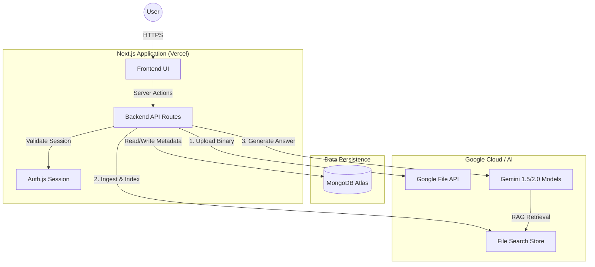
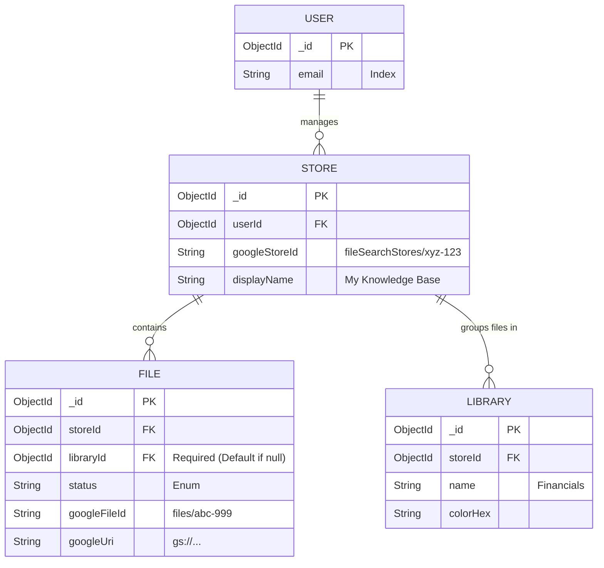
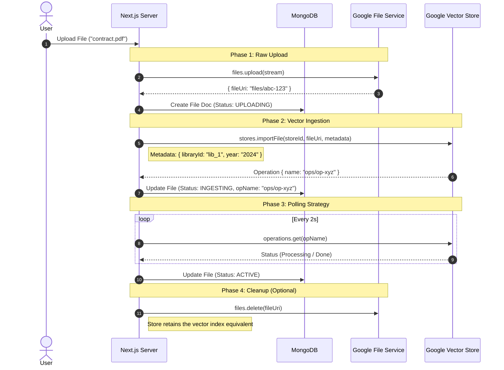
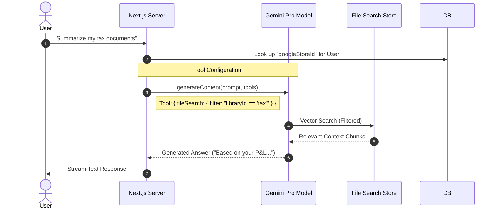
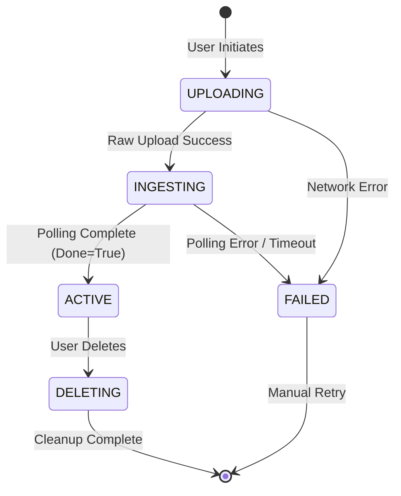
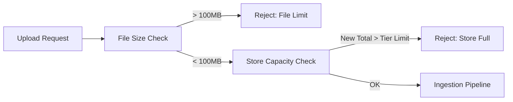

# 📐 System Diagrams & Architecture: File Search SaaS

**Version**: 1.0
**Reference**: `TECHNICAL_SPECS.md`
**Status**: APPROVED

This document serves as the visual reference for the system's architecture, data flows, and state logic.

---

## 1. High-Level Architecture (Container Diagram)

This diagram illustrates how the core components of the SaaS interact with external Google services.



---

## 2. Data Model (Entity Relationship)

We enable a **Multi-Store Architecture**: A User can manage multiple independent Vector Stores (e.g., "Personal", "Work"). Files and Libraries belong to a specific Store.



> **Critical Logic**: Uncategorized files are NOT allowed. If a user does not select a library, the system MUST automatically assign the file to a "Default" library (bootstrapped per user).

### 2.1 Sample MongoDB Records
To demonstrate the schema in practice, here is a snapshot of the database for a user with multiple libraries.

**User Collection**
```json
{
  "_id": "user_123",
  "email": "saeed@example.com",
  "name": "Saeed",
  "primaryStoreId": "store_1", // Links to the formal Store collection
  "createdAt": "2024-05-20T10:00:00Z"
}
```

**Store Collection**
```json
[
  {
    "_id": "store_1",
    "userId": "user_123",
    "googleStoreId": "fileSearchStores/store-xyz-789",
    "displayName": "Personal Knowledge Base",
    "sizeBytes": 4500000000, // 4.5 GB tracked locally
    "fileCount": 125,
    "status": "ACTIVE",
    "lastSyncedAt": "2024-05-25T14:30:00Z"
  }
]
```

**Libraries Collection**
```json
[
  {
    "_id": "lib_A",
    "userId": "user_123",
    "name": "Invoices",
    "icon": "💰",
    "color": "text-emerald-500",
    "description": "2024 Expenses"
  },
  {
    "_id": "lib_B",
    "userId": "user_123",
    "name": "Research",
    "icon": "🔬",
    "color": "text-blue-500"
  }
]
```

**Files Collection**
```json
[
  {
    "_id": "file_1",
    "userId": "user_123",
    "libraryId": "lib_A", // Linked to "Invoices"
    "displayName": "invoice_may.pdf",
    "mimeType": "application/pdf",
    "status": "ACTIVE",
    "googleFileId": "files/abc-001",
    "googleUri": "https://generativelanguage.googleapis.com/v1beta/files/abc-001",
    "sizeBytes": 102400
  },
  {
    "_id": "file_2",
    "userId": "user_123",
    "libraryId": null, // Uncategorized file
    "displayName": "random_notes.txt",
    "mimeType": "text/plain",
    "status": "PROCESSING",
    "googleFileId": "files/abc-002"
  }
]
```

---

## 3. Core Workflows (Sequence Diagrams)

### 3.1 The Ingestion Pipeline (Verified PoC)
This flow represents the **"Upload & Index"** process. It separates the raw upload from the semantic indexing.



### 3.2 The Chat Loop (RAG)
How we retrieve answers using the "One Store Per User" model.



---

## 4. State Machines

### 4.1 File Lifecycle
The state transitions for a `File` document in MongoDB.


---

## 5. Tiered Limits Architecture

The system enforces a strict hierarchical limit policy defined in `src/config/limits.ts`.

### 5.1 Limit Enforcement Flow


### 5.2 Tier Configuration
| Tier | Storage Limit | Per-File Limit | Best For |
| :--- | :--- | :--- | :--- |
| **FREE** | 1 GB | 100 MB | Evaluation |
| **TIER 1** | 10 GB | 100 MB | Professionals |
| **TIER 2** | 100 GB | 100 MB | Business |
| **TIER 3** | 1 TB | 100 MB | Enterprise |

> [!TIP]
> **Performance Recommendation**: While higher tiers allow massive storage, each File Search store should remain under **20GB** for optimal retrieval latencies. For users needing > 20GB, the system architecture supports horizontal scaling via multiple parallel stores.
