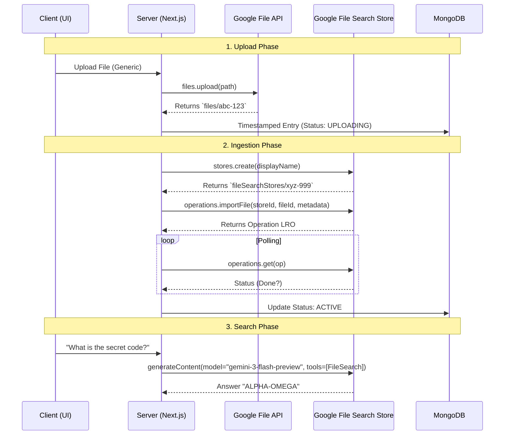

# ⚙️ Technical Specifications: File Search SaaS

**Version**: 1.0 (Post-PoC Validation)
**Status**: APPROVED for Development
**Reference PoC**: `poc/verify-specs.js`
**Visual Reference**: `SYSTEM_DIAGRAMS.md` (Detailed Diagrams & Flows)

---

## 1. Technology Stack
*   **Frontend**: Next.js 15 (App Router), TailwindCSS, Lucide Icons.
*   **Backend**: Next.js Server Actions / API Routes.
*   **Database**: MongoDB (Mongoose ODM).
*   **AI/LLM Logic**: Google Gemini API via `@google/genai` SDK.
*   **Authentication**: Auth.js (v5) - Google Provider.

---

## 2. Architecture & Data Flow

### 2.1 The RAG Pipeline (Verified)
The following flow has been validated to work with `gemini-3-flash-preview`.



---

## 3. Data Models (Mongoose Schemas)

### 3.1 User
Represents the account holder and their subscription state.
*   **_id**: ObjectId
*   **email**: String (Unique, Index)
*   **name**: String
*   **image**: String (Avatar URL)
*   **primaryStoreId**: ObjectId (Ref: Store) - *The active vector store.*
*   **tier**: Enum [`FREE`, `TIER_1`, `TIER_2`, `TIER_3`] (Default: `TIER_1`)

### 3.2 Store (Physical Resource)
Formal record representing a Google File Search Store.
*   **_id**: ObjectId
*   **userId**: ObjectId (Ref: User)
*   **googleStoreId**: String (Format: `fileSearchStores/UUID`)
*   **displayName**: String
*   **sizeBytes**: Number (Tracked locally for limit enforcement)
*   **fileCount**: Number
*   **lastSyncedAt**: Date

### 3.2 Collection (The Shelf)
Virtual organization unit.
*   **_id**: ObjectId
*   **userId**: ObjectId (Ref: User)
*   **name**: String ("Financials", "Research")
*   **description**: String
*   **icon**: String (Emoji or Icon Name)
*   **color**: String (Hex)

### 3.3 File (The Document)
The asset record linking local metadata to Google's vector store.
*   **_id**: ObjectId
*   **userId**: ObjectId (Ref: User)
*   **collectionId**: ObjectId (Ref: Collection, Required/Default)
*   **displayName**: String ("Contract_2024.pdf")
*   **mimeType**: String ("application/pdf", "text/plain")
*   **sizeBytes**: Number
*   **status**: Enum [`UPLOADING`, `INGESTING`, `ACTIVE`, `FAILED`]
*   **googleFileId**: String (`files/UUID`)
*   **googleUri**: String (`https://generativelanguage...`)
*   **googleOperationName**: String (`operations/UUID`) - *For debugging/polling recovery.*
*   **createdAt**: Date
*   **updatedAt**: Date

---

## 4. API Implementation Details (SDK)

### 4.1 SDK Initialization
```javascript
const { GoogleGenAI } = require('@google/genai');
const ai = new GoogleGenAI({ apiKey: process.env.GOOGLE_API_KEY });
// Model: "gemini-3-flash-preview" (Latest Preview with File Search Support)
```

### 4.2 Metadata Structure
The API is strict about metadata types. Use `stringValue` explicitly.

```javascript
const config = {
    customMetadata: [
        { key: "collectionId", stringValue: "col_12345" }, // String!
        { key: "year", stringValue: "2024" }
    ]
};
```

### 4.3 Polling Logic
Use strict object passing to avoid SDK errors.
```javascript
while (!operation.done) {
    await new Promise(r => setTimeout(r, 2000));
    operation = await ai.operations.get({ operation });
}
```

### 4.4 Global Cleanup (Dev Mode)
For development, use force delete on stores to reset quota.
```javascript
await ai.fileSearchStores.delete({ name: storeId, config: { force: true } });
```

---

## 5. System Status & Roadmap
1.  **Repo Init & Auth**: ✅ Verified and Implemented.
2.  **Mongoose Schema v2**: ✅ (User, Store, File, Collection).
3.  **Tiered Limits Pipeline**: ✅ (100MB per-file / Tiered Total Store).
4.  **UI Core**: ✅ Dashboard, Store Dashboard, Collections, Sidebar.
5.  **Search & Chat**: 🚧 (Next Focus: Global & Collection-level search loop).
