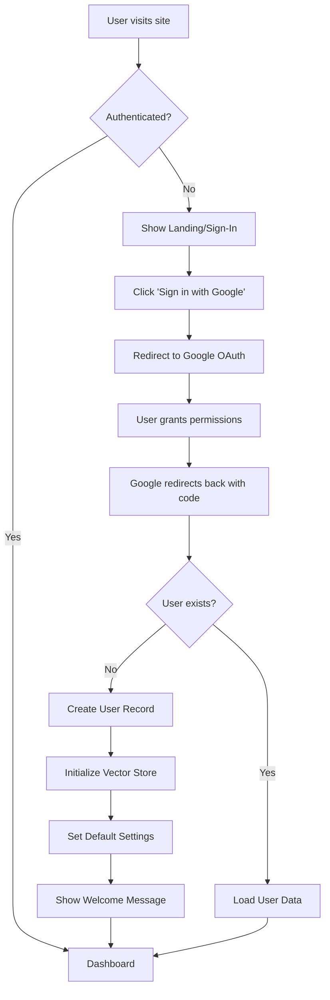
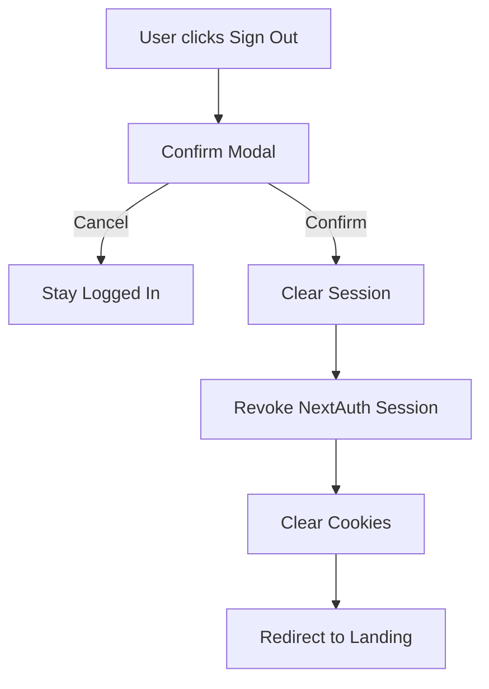
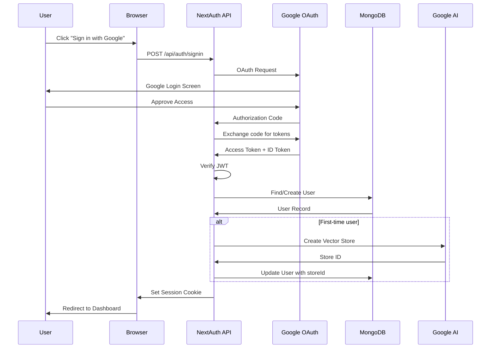
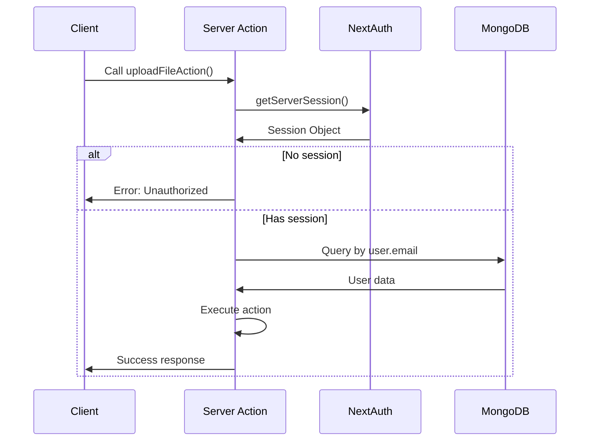

# Google OAuth Authentication Specification

**Version**: 1.0  
**Date**: 2026-02-04  
**Status**: Draft  
**Priority**: HIGH (Critical Security Requirement)

---

## 🎯 Overview

This specification outlines the implementation of Google OAuth 2.0 authentication to replace the current mock authentication system. This will enable secure user login/signup using Google accounts.

### Current State
- **Problem**: Hardcoded user email (`saeed@example.com`) across all server actions
- **Security Risk**: No authentication or authorization
- **Impact**: Cannot support multiple users or production deployment

### Proposed Solution
- Implement NextAuth.js v5 with Google Provider
- Add server-side session management
- Secure all server actions with authenticated sessions
- Implement user profile management

---

## 🎨 UI/UX Design

### Authentication Pages

#### 1. Landing Page (`/`)
**Current**: Direct access to dashboard  
**Proposed**: Auth-gated landing with sign-in option

```
┌─────────────────────────────────────┐
│   🔍 File Search RAG SaaS          │
│                                     │
│   Smart Document Search with AI    │
│                                     │
│   [🔐 Sign in with Google]         │
│                                     │
│   • Upload & organize documents    │
│   • AI-powered search              │
│   • Multi-library support          │
└─────────────────────────────────────┘
```

#### 2. Sign-In Page (`/auth/signin`)
**Design**: Clean, centered card with Google button

```
┌─────────────────────────────────────┐
│                                     │
│           Welcome Back              │
│                                     │
│   ┌───────────────────────────┐   │
│   │                           │   │
│   │   [G] Sign in with Google │   │
│   │                           │   │
│   └───────────────────────────┘   │
│                                     │
│   Secure OAuth 2.0 Authentication  │
└─────────────────────────────────────┘
```

#### 3. New User Onboarding
**Trigger**: First-time Google sign-in  
**Flow**: Auto-create user record → Initialize store → Redirect to dashboard

**Welcome Toast**:
```
✅ Welcome, [User Name]!
   Your account has been created.
   Ready to upload your first document?
```

### Navigation Updates

#### Sidebar Enhancement
**Add**: User profile section at bottom

```
┌─────────────────┐
│ 📁 Dashboard    │
│ 📚 Libraries    │
│ 💬 Chat         │
│ 🔍 Search       │
│ ⚙️  Settings    │
│                 │
│ ───────────────│
│ 👤 Saeed V.    │
│ saeed@gmail... │
│ [Sign Out]     │
└─────────────────┘
```

---

## 👤 User Flow

### Sign-Up Flow



### Sign-Out Flow



---

## 🔄 Data Flow

### Authentication Data Flow



### Session Validation Flow



---

## 🔌 API Flow

### Authentication Endpoints

#### 1. **NextAuth API Routes** (Auto-generated)
```
POST   /api/auth/signin/google     - Initiate Google OAuth
GET    /api/auth/callback/google   - OAuth callback
POST   /api/auth/signout           - Sign out user
GET    /api/auth/session           - Get current session
GET    /api/auth/csrf              - CSRF token
```

#### 2. **Protected Server Actions** (All existing)
**Before**:
```typescript
const USER_EMAIL = "saeed@example.com"; // ❌ Hardcoded
const user = await User.findOne({ email: USER_EMAIL });
```

**After**:
```typescript
const session = await getServerSession(authOptions);
if (!session?.user?.email) {
  return { error: "Unauthorized" };
}
const user = await User.findOne({ email: session.user.email });
```

---

## 🗄️ Database Model Updates

### User Model Changes

**File**: `src/models/User.ts`

```typescript
// ADDED FIELDS
interface IUser {
  // ... existing fields ...
  
  // OAuth Fields (NEW)
  googleId?: string;          // Google account unique ID
  image?: string;             // Profile picture URL from Google
  emailVerified?: Date;       // Email verification timestamp
  
  // Session Management (NEW)
  lastLogin?: Date;           // Track login activity
  createdAt: Date;            // Auto-generated (update schema)
  updatedAt: Date;            // Auto-generated (update schema)
}
```

**Migration Plan**:
1. Add new optional fields to schema
2. Existing mock user remains compatible
3. Populate fields on first OAuth login
4. No data migration required (backward compatible)

### Session Schema (NextAuth)

**Managed by**: NextAuth.js built-in adapter  
**Collections**: `accounts`, `sessions`, `users`, `verification_tokens`

**Option 1 - Default JWT** (Recommended):
- No additional DB tables needed
- Session stored in encrypted JWT cookie
- Faster, stateless authentication

**Option 2 - Database Sessions**:
- Requires MongoDB adapter
- Sessions stored in DB
- Better for multi-device logout

**Recommended**: Start with JWT, migrate to DB sessions if needed

---

## 🛣️ New Routes

### 1. Auth Pages

```
src/app/auth/
├── signin/
│   └── page.tsx          # Custom sign-in page (NextAuth default)
├── error/
│   └── page.tsx          # Auth error page
└── new-user/
    └── page.tsx          # First-time onboarding (optional)
```

### 2. API Routes

```
src/app/api/
└── auth/
    └── [...nextauth]/
        └── route.ts      # NextAuth handler (required)
```

### 3. Middleware (NEW)

```
src/middleware.ts         # Protect routes, redirect unauthenticated users
```

**Protected Routes**:
- `/` (dashboard)
- `/libraries/*`
- `/chat/*`
- `/settings/*`
- `/store`
- `/search`
- `/playground`

**Public Routes**:
- `/auth/signin`
- `/auth/error`
- `/api/auth/*`

---

## ⚙️ Configuration Files

### 1. NextAuth Configuration

**File**: `src/lib/auth.ts` (NEW)

```typescript
import NextAuth, { NextAuthOptions } from "next-auth";
import GoogleProvider from "next-auth/providers/google";
import connectToDatabase from "./db";
import User from "@/models/User";
import { GoogleAIService } from "./google-ai";

export const authOptions: NextAuthOptions = {
  providers: [
    GoogleProvider({
      clientId: process.env.GOOGLE_CLIENT_ID!,
      clientSecret: process.env.GOOGLE_CLIENT_SECRET!,
      authorization: {
        params: {
          scope: "openid email profile",
        },
      },
    }),
  ],
  
  callbacks: {
    async signIn({ user, account, profile }) {
      // Auto-create user on first login
      await connectToDatabase();
      
      let dbUser = await User.findOne({ email: user.email });
      
      if (!dbUser) {
        // Create vector store for new user
        const store = await GoogleAIService.createStore(
          `store-${user.email}`
        );
        
        dbUser = await User.create({
          email: user.email,
          name: user.name,
          googleId: account?.providerAccountId,
          image: user.image,
          primaryStoreId: null, // Will link after Store creation
          emailVerified: new Date(),
          lastLogin: new Date(),
        });
        
        // Link store to user (would need to save Store model first)
      } else {
        // Update last login
        dbUser.lastLogin = new Date();
        await dbUser.save();
      }
      
      return true;
    },
    
    async session({ session, token }) {
      // Add user ID to session
      if (session.user) {
        session.user.id = token.sub;
      }
      return session;
    },
  },
  
  pages: {
    signIn: "/auth/signin",
    error: "/auth/error",
  },
  
  session: {
    strategy: "jwt",
    maxAge: 30 * 24 * 60 * 60, // 30 days
  },
};

export default NextAuth(authOptions);
```

### 2. Middleware Configuration

**File**: `src/middleware.ts` (NEW)

```typescript
export { default } from "next-auth/middleware";

export const config = {
  matcher: [
    "/((?!auth|api/auth|_next/static|_next/image|favicon.ico).*)",
  ],
};
```

### 3. Environment Variables

**File**: `.env` (UPDATE)

```bash
# Existing
GOOGLE_API_KEY=your_gemini_api_key
MONGO_URI=mongodb://localhost:27017/file-search

# NEW - Google OAuth
GOOGLE_CLIENT_ID=your_google_client_id.apps.googleusercontent.com
GOOGLE_CLIENT_SECRET=your_google_client_secret

# NEW - NextAuth
NEXTAUTH_URL=http://localhost:3000
NEXTAUTH_SECRET=your_random_secret_key_here_generate_with_openssl
```

**Generate Secret**:
```bash
openssl rand -base64 32
```

### 4. Google Cloud Console Setup

**Steps**:
1. Go to [Google Cloud Console](https://console.cloud.google.com/)
2. Create new project or select existing
3. Enable "Google+ API"
4. Go to "Credentials" → "Create Credentials" → "OAuth 2.0 Client ID"
5. Application type: "Web application"
6. Authorized redirect URIs:
   - `http://localhost:3000/api/auth/callback/google` (dev)
   - `https://yourdomain.com/api/auth/callback/google` (prod)
7. Copy Client ID and Client Secret to `.env`

---

## 📦 Dependencies

### New Packages

```bash
npm install next-auth@beta
npm install @auth/mongodb-adapter  # If using DB sessions (optional)
```

**Current NextAuth Version**: v5 (beta)  
**Why beta?**: Full support for Next.js 15 App Router

---

## 🔐 Security Considerations

### 1. Session Security
- ✅ HTTPOnly cookies (prevent XSS)
- ✅ SameSite=Lax (CSRF protection)
- ✅ Signed JWT tokens
- ✅ Automatic session refresh

### 2. OAuth Security
- ✅ State parameter (CSRF protection)
- ✅ PKCE (for public clients)
- ✅ Proper redirect URI validation
- ✅ Token expiration handling

### 3. Server Action Security
**Pattern to apply to ALL actions**:
```typescript
export async function protectedAction() {
  "use server";
  
  const session = await getServerSession(authOptions);
  
  if (!session?.user?.email) {
    return { error: "Please sign in to continue" };
  }
  
  // Continue with authenticated logic
}
```

---

## 🚀 Implementation Phases

### Phase 1: NextAuth Setup (Day 1)
- [ ] Install dependencies
- [ ] Configure Google OAuth in Cloud Console
- [ ] Set up environment variables
- [ ] Create NextAuth configuration (`auth.ts`)
- [ ] Add API route handler
- [ ] Update User model schema

### Phase 2: UI Implementation (Day 2)
- [ ] Create sign-in page
- [ ] Create error page
- [ ] Add user profile to sidebar
- [ ] Implement sign-out button
- [ ] Add loading states
- [ ] Create middleware for route protection

### Phase 3: Server Action Migration (Day 3)
- [ ] Create `getAuthenticatedUser()` helper
- [ ] Update `file-actions.ts` (remove mock email)
- [ ] Update `chat-actions.ts` (remove mock email)
- [ ] Update `user-actions.ts` (remove mock email)
- [ ] Update `playground.ts` (if needed)
- [ ] Add error handling for unauthorized access

### Phase 4: Testing & Polish (Day 4)
- [ ] Test sign-in flow
- [ ] Test sign-out flow
- [ ] Test first-time user creation
- [ ] Test protected routes
- [ ] Test server action authentication
- [ ] Add demo video to walkthrough
- [ ] Update CONTRIBUTING.md

---

## 🧪 Testing Checklist

### Manual Testing
- [ ] Can sign in with Google account
- [ ] First-time user gets new store created
- [ ] Returning user sees existing data
- [ ] Can upload files after authentication
- [ ] Can access chat features
- [ ] Sign out clears session
- [ ] Cannot access protected routes when signed out
- [ ] Profile picture displays correctly
- [ ] User name displays in sidebar

### Edge Cases
- [ ] Network failure during OAuth
- [ ] User denies permissions
- [ ] Multiple Google accounts
- [ ] Session expiration handling
- [ ] Race condition during user creation

---

## 📊 Success Metrics

- **Auth Success Rate**: >99% of OAuth flows complete successfully
- **Sign-in Time**: <3 seconds from click to dashboard
- **Session Duration**: 30 days (configurable)
- **Security Audit**: 0 critical vulnerabilities
- **User Experience**: No manual email entry required

---

## 🔄 Migration Path

### For Existing Mock Users

**Current Data**:
```typescript
{ email: "saeed@example.com", name: "Saeed", ... }
```

**Migration Strategy**:
1. On first OAuth login with matching email
2. Link Google account to existing user record
3. Populate `googleId`, `image`, `emailVerified`
4. Keep all existing data (stores, files, libraries)

**No data loss, seamless transition**

---

## 📚 References

- [NextAuth.js Documentation](https://next-auth.js.org/)
- [Google OAuth 2.0 Guide](https://developers.google.com/identity/protocols/oauth2)
- [Next.js Middleware](https://nextjs.org/docs/app/building-your-application/routing/middleware)
- [NextAuth MongoDB Adapter](https://authjs.dev/getting-started/adapters/mongodb)

---

## ⚠️ Breaking Changes

### API Changes
- All server actions now require authentication
- Unauthenticated requests return `{ error: "Unauthorized" }`

### Environment Variables
- **Required**: `GOOGLE_CLIENT_ID`, `GOOGLE_CLIENT_SECRET`, `NEXTAUTH_SECRET`
- **Updated**: `NEXTAUTH_URL` for production deployment

### User Experience
- Users must sign in before accessing any features
- No anonymous access to dashboard or file operations
- Session expires after 30 days of inactivity

---

**Estimated Implementation Time**: 3-4 days  
**Risk Level**: Medium (external OAuth dependency)  
**Rollback Plan**: Revert to mock auth, restore previous server actions
